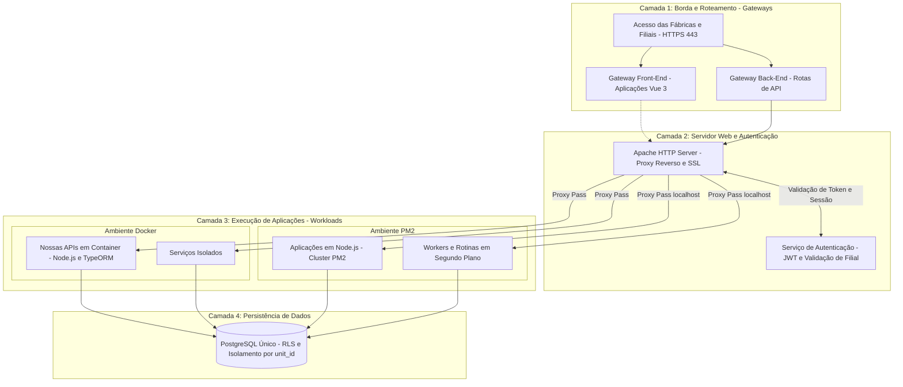

# Padrões de Arquitetura e Engenharia de Software

Este repositório centraliza as diretrizes técnicas, padrões arquiteturais e fluxos de dados oficiais adotados no desenvolvimento e manutenção de todas as nossas aplicações internas.

---

## Topologia Geral da Nossa Infraestrutura

O diagrama abaixo ilustra o fluxo completo de uma requisição desde a borda até a camada de persistência:

---

## Estrutura e Índice da Documentação

- [01 - Visão Geral e Mapa de Sistemas](docs/01-visao-geral/mapa-sistemas.md)
- [02 - Histórico de Decisões de Arquitetura (ADRs)](docs/02-adrs/)
- [03 - Arquitetura de Infraestrutura e Topologia](docs/03-arquitetura-infra/topologia-camadas-e-fluxos.md)
- [04 - Padrões de Backend e Persistência TypeORM](docs/04-padroes-backend/orm-e-acesso-a-dados.md)
- [05 - Padrões de Frontend Vue 3](docs/05-padroes-frontend/estrutura-vue.md)
- [06 - Padrões de Banco, Multi-Tenancy e RLS](docs/06-padroes-dados/politicas-rls.md)
- [07 - Automação e IoT Industrial](docs/07-automacao-e-iot/barramento-mqtt.md)
- [08 - Governança, Ciclo de Vida e Releases](docs/08-governanca-e-processos/ciclo-de-vida-software.md)
