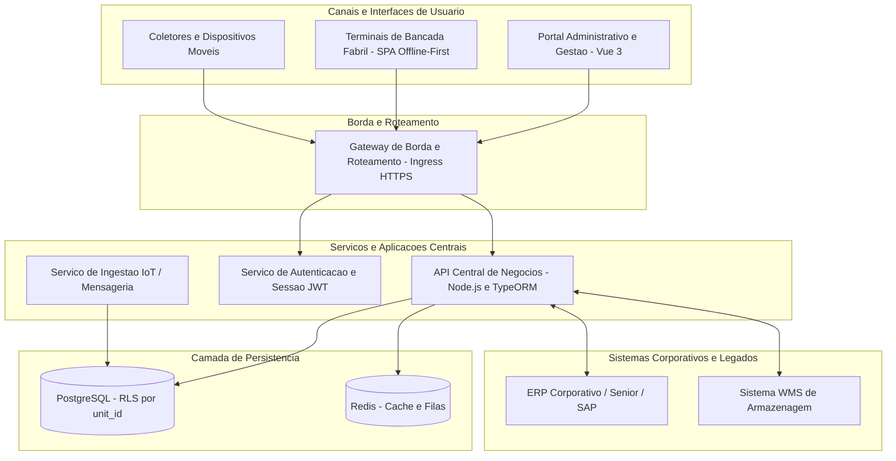

# Visão Geral: Mapa de Sistemas e Ecossistema Corporativo

## 1. Visão Geral
Este documento apresenta o panorama geral de todos os sistemas, portais, serviços de borda e integrações que compõem a arquitetura de tecnologia da organização.

---

## 2. Diagrama de Contexto de Sistemas

---

## 3. Principais Módulos do Ecossistema

* **Portal Administrativo:** Aplicação web em Vue 3 para gestão executiva, cadastros gerais, emissão de relatórios e controle de permissões.
* **Terminais de Bancada:** SPAs instaladas nos postos operacionais das fábricas, projetadas com recursos de alta ergonomia e tolerância a falhas (Offline-First).
* **API Central de Negócios:** Backend em Node.js estruturado sob o padrão Data Mapper com TypeORM, implementando validações de regras e auditoria automática.
* **Barramento de Automação:** Ingestão contínua de telemetrias industriais (balanças, prensas, esteiras e RFID).
