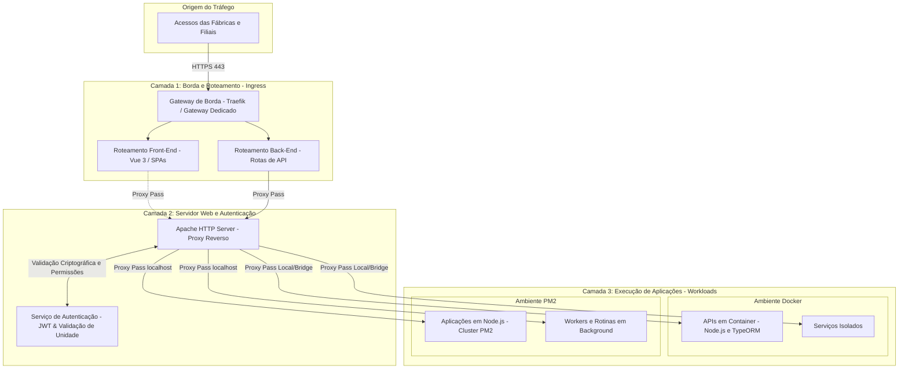

# Diretriz de Infraestrutura: Gateway de Borda e Roteamento de Tráfego

## 1. Visão Geral
Este documento estabelece o padrão corporativo de roteamento, balanceamento de tráfego e segmentação de conexões entre as redes de fábricas/filiais e os ambientes de execução das nossas aplicações internas. A infraestrutura adota uma divisão estrita de responsabilidades entre a camada de borda (*Ingress*) e a camada interna de servidor web e proxy reverso.

---

## 2. Divisão de Papéis da Arquitetura

### 2.1. Camada 1: Borda e Roteamento (*Ingress Gateways*)
* **Tecnologia:** Gateway de borda corporativo (Traefik ou Gateway dedicado de entrada).
* **Ponto de Entrada Único:** Recebimento e terminação segura de todo o tráfego externo proveniente das fábricas e filiais corporativas via HTTPS (porta 443) com certificados SSL/TLS gerenciados.
* **Segregação de Tráfego:**
  * **Gateway Front-End:** Roteamento de acessos a SPAs, páginas web e assets visuais das interfaces Vue 3.
  * **Gateway Back-End:** Roteamento de chamadas de APIs REST, microsserviços e integrações transacionais.
* **Regra de Isolamento:** Nenhuma aplicação ou porta de banco de dados é exposta diretamente à internet ou à rede externa sem passar pela filtragem e roteamento dos gateways de borda.

### 2.2. Camada 2: Servidor Web e Proxy Reverso (Apache & Auth JWT)
* **Tecnologia:** Apache HTTP Server operando como Proxy Reverso central e integrador de autenticação.
* **Validação de Sessão e Auth JWT:** O Apache atua em conjunto com o serviço de autenticação corporativo para validação criptográfica de tokens JWT, identificando a unidade (`unit_id`), o usuário e as permissões de acesso antes do encaminhamento transacional.
* **Distribuição de Carga (*Proxy Pass*):** Distribui as requisições autenticadas e sanitizadas para os ambientes de execução da Camada 3:
  * **Containers Docker:** APIs Node.js com TypeORM e serviços isolados rodando em rede bridge/interna.
  * **Clusters PM2:** Aplicações Node.js de alta disponibilidade e workers de segundo plano em execução local.
* **Propagação de Contexto:** Repasse seguro de cabeçalhos (`Authorization`, `X-Forwarded-For`, `X-Forwarded-Proto`) e injeção do contexto do operador e unidade fabril nas chamadas internas.

---

## 3. Diagrama de Fluxo de Roteamento

---

## 4. Diretrizes e Regras Mandatórias

1. **Escuta Local Exclusiva:** Todas as aplicações e microserviços em PM2 e Docker devem escutar estritamente em interfaces de rede locais (`127.0.0.1` ou redes virtuais internas do Docker), sendo terminantemente proibido o bind em interfaces públicas `0.0.0.0` sem controle do Apache.
2. **Preservação de Cabeçalhos:** Os gateways e proxies reverso devem obrigatoriamente manter e propagar os cabeçalhos de rastreamento (`X-Request-Id`, `X-Forwarded-For`, `Authorization`).
3. **Terminação e Renovação SSL:** A terminação SSL ocorre na Camada 1, garantindo criptografia ponta a ponta a partir das plantas industriais com certificados gerenciados de forma centralizada.