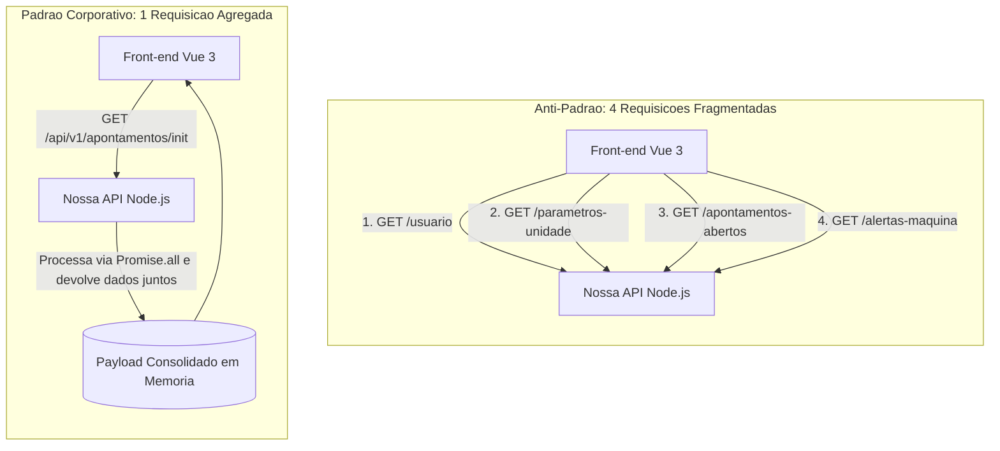

# Diretriz Corporativa: Padrões de API REST, Contratos e Agregação de Carga

## 1. Visão Geral

Em ambientes industriais com fábricas distribuídas e conexões de rede WAN, a latência de tráfego exige contratos de API altamente eficientes. Esta diretriz estabelece a arquitetura obrigatória para nomenclatura de rotas, formato padronizado de erros, paginação escalável e a unificação de requisições em viagens únicas (_single round-trip_).

---

## 2. Padrão de Endpoints Agregados (Combate a Chatty APIs)

### 2.1. Princípio de Viagem Única

Para evitar sobrecarga de conexões e telas lentas nas filiais, **é expressamente proibido o uso de chamadas fragmentadas**, onde o front-end precisa disparar múltiplas requisições sequenciais ou concorrentes para montar o estado inicial de uma tela.

- **Anti-Padrão (Chatty API):** O front-end Vue 3 realiza requisições separadas para `/usuario`, `/configuracoes-unidade`, `/ordens-abertas` e `/alertas`.
- **Padrão Obrigatório (Composite / Init Endpoint):** O front-end executa uma única chamada de inicialização (`GET /api/v1/{modulo}/init` ou `/contexto`), e o backend consolida todos os dados em um único payload estruturado.

### 2.2. Fluxo Comparativo de Carga de Rede



### 2.3. Parâmetro de Inclusão (`include`)

Quando um endpoint responde por uma entidade transacional (ex: `/api/v1/ordens-corte`), dados relacionados devem ser solicitados na mesma requisição via query parameter, eliminando viagens adicionais:

- **Exemplo:** `GET /api/v1/ordens-corte/018f45a2-34b1-7890-a1b2-c3d4e5f60718?include=itens,operador,historico`

---

## 3. Estrutura e Nomenclatura de Rotas

1. **Prefixo Obrigatório de Versão:** Toda rota de API deve iniciar obrigatoriamente com `/api/v1/`.
2. **Substantivos no Plural:** Utilizar sempre substantivos no plural com separador em `kebab-case`.
   - **Padrão Aceito:** `/api/v1/ordens-producao`, `/api/v1/materiais-consumo`.
   - **Proibido:** `/api/v1/salvarOrdem`, `/api/v1/material`, `/api/v1/obter_dados`.
3. **Identificadores na Rota:** Parâmetros de caminho utilizam exclusivamente o UUIDv7 da entidade.
   - `GET /api/v1/ordens-producao/{id}`
   - `PATCH /api/v1/ordens-producao/{id}`

---

## 4. Verbos HTTP e Códigos de Resposta

| Verbo      | Ação                                      | Status de Sucesso        | Casos de Erro Comuns                          |
| :--------- | :---------------------------------------- | :----------------------- | :-------------------------------------------- |
| **GET**    | Consulta de dados ou listagem agregada    | `200 OK`                 | `404 Not Found`                               |
| **POST**   | Criação de recurso ou ação de negócio     | `201 Created` / `200 OK` | `400 Bad Request`, `422 Unprocessable Entity` |
| **PATCH**  | Atualização parcial de campos do registro | `200 OK`                 | `400 Bad Request`, `404 Not Found`            |
| **DELETE** | Execução de exclusão lógica (Soft Delete) | `204 No Content`         | `404 Not Found`, `409 Conflict`               |

---

## 5. Paginação Escalável por Cursor (Keyset Pagination)

Para garantir resposta abaixo de 50ms mesmo em tabelas com milhões de apontamentos:

- **Proibido o uso de `OFFSET`** para tabelas transacionais de alto volume.
- **Uso Obrigatório de Cursor:** A paginação apoia-se na ordenação temporal natural do UUIDv7.

### Formato do Contrato de Paginação:

- **Requisição:** `GET /api/v1/apontamentos?limit=50&after_id=018f45a2-34b1-7890-a1b2-c3d4e5f60718`
- **Resposta Padrão:**

```json
{
  "data": [
    {
      "id": "018f45a2-34b1-7890-a1b2-c3d4e5f60718",
      "codigo": "ORD-100",
      "unit_id": "SEST"
    }
  ],
  "pagination": {
    "limit": 50,
    "has_more": true,
    "next_cursor": "018f45b5-88a2-7890-b3c4-d5e6f7a8b9c0"
  }
}
```

---

## 6. Tratamento Padronizado de Erros (RFC 7807)

Todas as falhas retornadas pelas APIs devem adotar a especificação **RFC 7807 (Problem Details)**, facilitando a identificação imediata do problema no front-end:

```json
{
  "type": "[https://api.empresa.local/erros/validacao-campos](https://api.empresa.local/erros/validacao-campos)",
  "title": "Dados invalidos na solicitacao",
  "status": 422,
  "detail": "Um ou mais campos enviados estao fora do formato esperado.",
  "instance": "/api/v1/ordens-corte",
  "trace_id": "c8a1b293-87f1-4a11-b0e2-89d123456789",
  "errors": [
    {
      "field": "quantidade",
      "message": "A quantidade deve ser maior que zero."
    }
  ]
}
```
