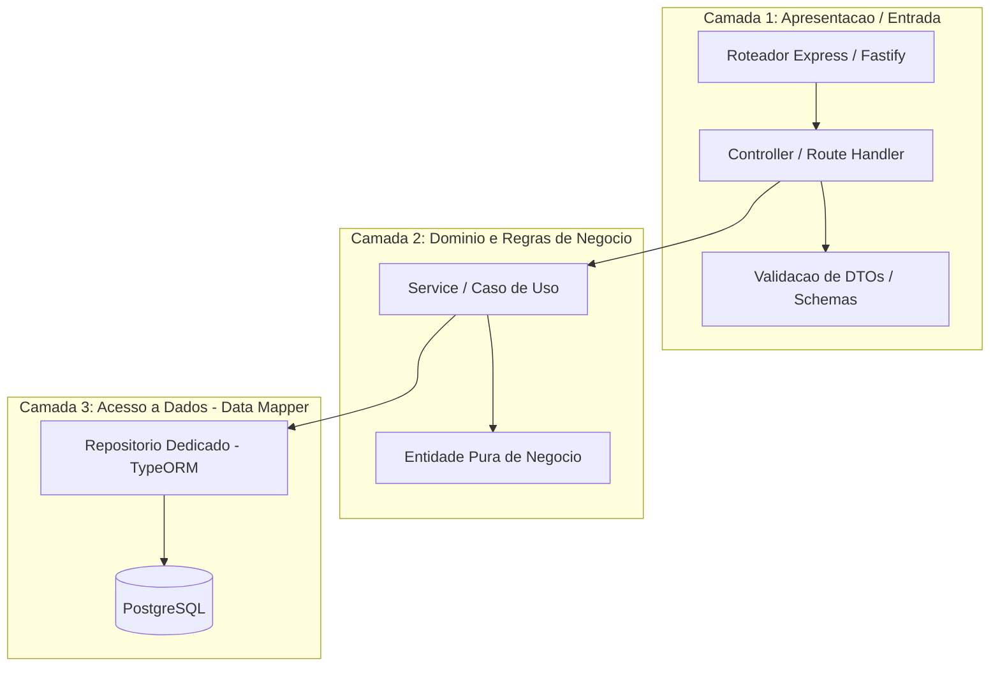

# Diretriz Corporativa: Arquitetura em Camadas no Backend (Node.js)

## 1. Visão Geral e Princípios
As APIs corporativas devem seguir uma arquitetura em camadas estritamente desacoplada (Clean Architecture / Layered Architecture). O objetivo é isolar regras de negócio de detalhes de infraestrutura, facilitando a criação de testes automatizados e a manutenção a longo prazo.

---

## 2. Diagrama de Camadas da Aplicação

---

## 3. Responsabilidades de Cada Camada

### 3.1. Controllers (Camada de Apresentação)
* Recebe a requisição HTTP e extrai parâmetros, cabeçalhos (`unit_id`, `user_id`) e corpo.
* Executa validações de contrato (ex: bibliotecas como `zod` ou `class-validator`).
* Delega o processamento ao Service correspondente e mapeia o resultado para o código de status HTTP adequado (ou RFC 7807 em caso de erro).
* **Regra Rígida:** É proibido executar consultas SQL ou conter lógica de regras de negócio dentro de controllers.

### 3.2. Services / Casos de Uso (Camada de Domínio)
* Centraliza toda a regra de negócio e lógica operacional.
* Orquestra chamadas a múltiplos repositórios, serviços externos e eventos do barramento MQTT.
* Controla a demarcação de transações atômicas de banco quando necessário.

### 3.3. Repositories (Camada de Persistência - Data Mapper)
* Encapsula exclusivamente a interação com o TypeORM e a execução de queries.
* Converte registros do banco em entidades de domínio.
* Nunca expõe detalhes do driver SQL para as camadas superiores.
