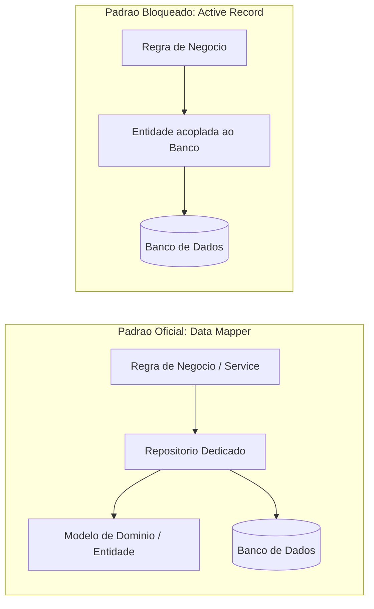

# Diretriz Corporativa: Camada de Persistência com TypeORM

## 1. Visão Geral e Princípio

O TypeORM é o padrão corporativo oficial para mapeamento objeto-relacional e comunicação com o banco de dados em todas as aplicações da organização. O objetivo desta diretriz é manter a integridade relacional, a portabilidade de regras de negócio e evitar gargalos de performance em ambientes multi-unidades.

---

## 2. Regras de Arquitetura Obrigatórias

### 2.1. Padrão Data Mapper (Exclusivo)

- **Diretriz:** Toda interação com o banco de dados deve utilizar repositórios dedicados (`Repository` ou `CustomRepository`).
- **Restrição:** É proibido o uso do padrão _Active Record_ (onde a entidade estende classes de persistência direta). O modelo de domínio não deve conhecer a infraestrutura de banco de dados.

### 2.2. Gestão de Esquema e Migrations

- **Sincronização Automática:** A configuração de sincronização automática do esquema (`synchronize`) é estritamente proibida em ambientes de Homologação, QA e Produção.
- **Ciclo de Vida das Migrações:** Toda e qualquer alteração no banco de dados deve ser executada exclusivamente por arquivos de migração versionados no Git e aplicados via pipeline de CI/CD. Alterações manuais em produção são consideradas não conformidades graves.

### 2.3. Herança de Auditoria e Isolamento

- Toda entidade do ecossistema corporativo deve herdar obrigatoriamente uma entidade base de auditoria contendo identificador único, rastreamento temporal de criação e atualização, exclusão lógica (soft delete), identificador de usuário criador e o identificador da unidade fabril de origem (`unit_id`).

---

## 3. Diretrizes de Performance e Segurança

### 3.1. Operações em Lote no Chão de Fábrica

- Métodos de salvamento que disparam consultas prévias individuais de verificação não devem ser usados em fluxos de alta frequência (leituras de esteiras, sensores e apontamentos em massa). Nesses casos, a escrita deve ocorrer via comandos explícitos de inserção direta em lote pelo construtor de consultas.

### 3.2. Controle de Relacionamentos e Consultas Profundas

- É proibido o carregamento automático de relacionamentos aninhados sem limite de profundidade, prevenindo a formação de produtos cartesianos e lentidão crítica nas tabelas de produção.
- Consultas para telas de listagem, painéis e relatórios devem solicitar estritamente as colunas necessárias para a visualização, evitando o carregamento de estruturas relacionais completas na memória da aplicação.

### 3.3. Exclusão de Registros (Soft Delete)

- Por padrão de conformidade e auditoria fabril, dados não são excluídos fisicamente do banco de dados relacional. Devem ser adotadas marcas de exclusão lógica, garantindo rastreabilidade histórica e conformidade com auditorias operacionais.
---

## Fluxo Comparativo: Data Mapper (Obrigatório) vs Active Record (Proibido)

