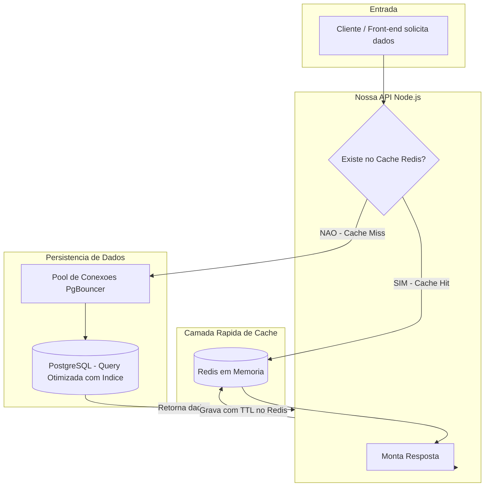
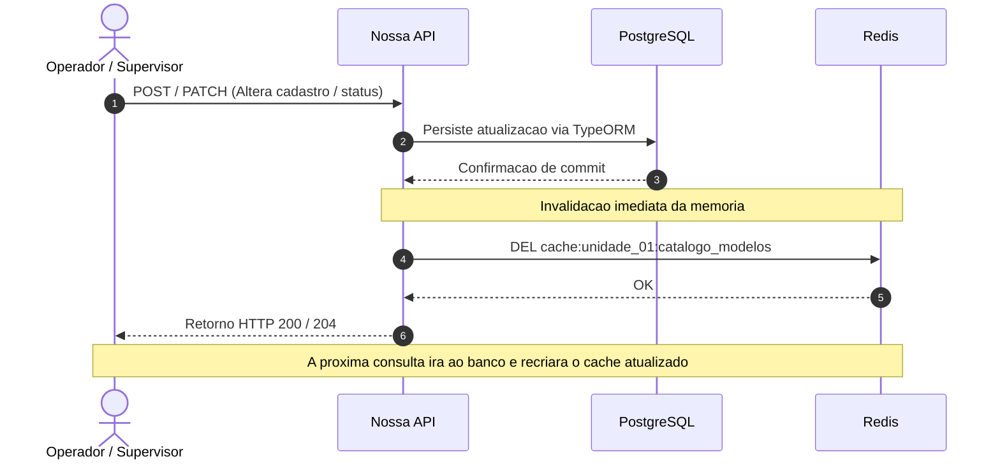

# Diretriz Corporativa: Otimização, Cache e Performance

## 1. Visão Executiva (Resumo para Gestão)

A expansão de sistemas para múltiplas fábricas aumenta exponencialmente o tráfego concorrente de requisições. Para que o banco central e os servidores não degradem nos picos de turno, o ecossistema adota uma estratégia de otimização em 4 níveis:

1. **Cache em Memória (Redis):** Reduz até 70% das leituras no banco para dados de catálogos, cadastros e permissões.
2. **Pool de Conexões Controlado:** Impede que múltiplos containers e instâncias PM2 travem o PostgreSQL por excesso de conexões abertas.
3. **Paginação por Cursor (Keyset):** Garante tempo de resposta constante (< 50ms) mesmo em listagens de milhões de apontamentos.
4. **Operações em Lote no Backend:** Chão de fábrica grava eventos em blocos de alta velocidade, eliminando gargalos de inserção unitária.

---

## 2. Diagrama do Fluxo de Otimização (Padrão Cache-Aside)

O fluxograma abaixo detalha o caminho de uma consulta desde a chegada na API até a entrega dos dados, priorizando a camada rápida de memória:

---

## 3. Fluxo de Escrita e Invalidação de Cache

Para garantir que operadores não trabalhem com informações desatualizadas (ex: alteração de ficha técnica ou paralisação de máquina), toda gravação invalida a chave de cache correspondente de forma reativa:

---

## 4. Pilares Técnicos Mandatórios

### 4.1. Camada de Cache em Memória (Redis)

- **Padrão de Adoção:** Uso obrigatório para dados de baixa mutabilidade e alta leitura (catálogos de peças, tabelas de-para, modelos de calçados, permissões setoriais e parâmetros de fábrica).
- **Política de TTL (Time-To-Live):** Nenhuma chave de cache pode ser persistida sem expiração temporal definida.
  - Dados semi-estáticos: TTL entre 15 e 60 minutos.
  - Sessões e tokens: TTL vinculado ao ciclo de expiração do login.
- **Nomenclatura Padrão de Chaves:**
  - Formato: `cache:{unit_id}:{modulo}:{entidade_ou_filtro}`
  - Exemplo: `cache:SEST:materiais:linha_40`

### 4.2. Gestão de Conexões de Banco de Dados

- **Proibição de Conexão Ilimitada:** É proibido que aplicações Node.js abram conexões diretas sem limite com o banco de produção.
- **Pool Centralizado (PgBouncer):** O tráfego do TypeORM para o PostgreSQL deve transitar por um pool gerenciado em modo _transaction pooling_, mantendo o número de conexões ativas no Postgres estritamente controlado.
- **Limites no TypeORM:** Configuração máxima de 10 a 15 conexões ativas por container/instância de processo.

### 4.3. Estratégia de Paginação em Tabelas Pesadas

- **Proibição do `OFFSET` em Alto Volume:** É expressamente proibido o uso de `OFFSET` para paginação em tabelas com mais de 50.000 registros (apontamentos de produção, registros de corte, leituras de sensores).
- **Padrão Keyset / Cursor:** A paginação deve ser estruturada com base no identificador ordenado (`WHERE id > :ultimo_id ORDER BY id ASC LIMIT 50`), assegurando que a página 100 tenha exatamente o mesmo tempo de processamento da página 1.

### 4.4. Operações de Inserção em Massa (Bulk Insert)

- **Eliminação de Loops de `.save()`:** Em rotinas de sincronização, apontamentos contínuos ou leituras de bancadas industriais, nunca execute `.save()` dentro de laços de repetição (`forEach`, `for`).
- **Inserção em Blocos:** O processamento deve agrupar os dados em lotes (ex: 500 registros por query) e executar a escrita em lote via construtor de consultas direto (`insert().into().values([...]).execute()`).

### 4.5. Seleção Estrita de Campos (Projeção)

- Em telas de painel, grades de monitoramento e tabelas operacionais, a consulta deve requisitar estritamente as colunas exibidas na tela, evitando o tráfego desnecessário de objetos inteiros e relacionamentos profundos pela rede corporativa.
