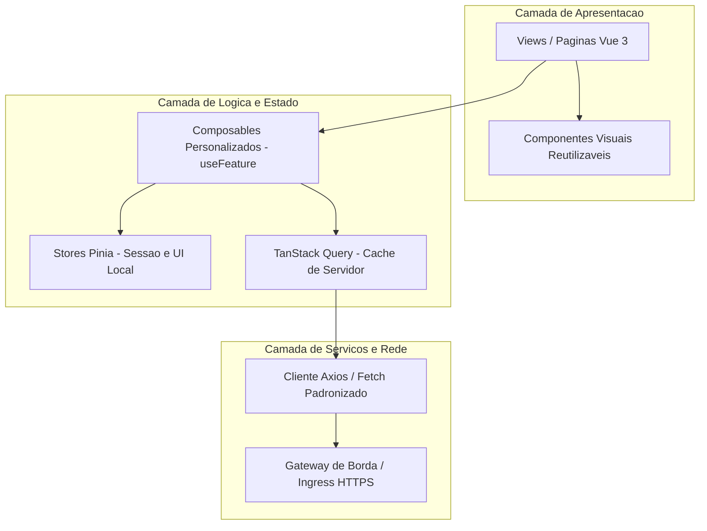

# Diretriz Corporativa: Arquitetura e Padrões Front-End (Vue.js 3)

## 1. Visão Geral e Princípios
O desenvolvimento de interfaces de usuário corporativas e telas de chão de fábrica adota exclusivamente o framework **Vue.js 3** com **TypeScript em modo estrito**.

### Princípios Norteadores:
* **Composition API Exclusiva:** Toda lógica de componentes deve utilizar a sintaxe `<script setup lang="ts">`. A sintaxe legada *Options API* é terminantemente proibida em novos projetos.
* **Componentização Atômica e Reutilizável:** Separação entre componentes visuais puros (UI/Dumb components) e componentes de página/contêineres de dados (Smart views).
* **Tipagem Estrita de Ponta a Ponta:** Nenhuma prop, emit ou retorno assíncrono pode ser tipado como `any`.

---

## 2. Diagrama de Arquitetura Front-End



---

## 3. Estrutura Canônica de Diretórios

Todas as aplicações front-end devem seguir a estrutura padronizada:

```text
src/
├── assets/          # Imagens, ícones SVG e fontes estáticas
├── components/      # Componentes visuais atômicos compartilhados (botões, modais, inputs)
├── composables/     # Hooks de lógica de negócio reutilizáveis (ex: useApontamento, useAuth)
├── router/          # Configuração de rotas e guards de navegação (Vue Router)
├── stores/          # Stores globais do Pinia (sessão, usuário, tema, filial ativa)
├── services/        # Clientes HTTP e funções de chamada às rotas de API
├── types/           # Interfaces e tipos TypeScript corporativos
├── views/           # Páginas completas mapeadas nas rotas
├── App.vue          # Componente raiz da aplicação
└── main.ts          # Ponto de entrada, plugins e inicialização
```

---

## 4. Estilização e Design System (Tailwind CSS)

* **Design Tokens:** As cores da marca, espaçamentos, tipografia e bordas são padronizados via classes utilitárias do **Tailwind CSS**.
* **Contraste e Ergonomia Fabril:** Telas operacionais de terminal e chão de fábrica devem priorizar alto contraste, botões com áreas de toque amplas (mínimo 48px de altura) e feedback visual imediato de status (sucesso, erro, alerta).
