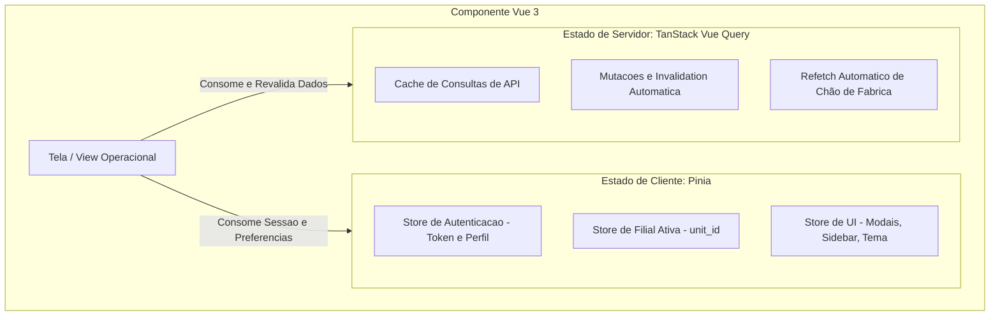

# Diretriz Corporativa: Gerenciamento de Estado Front-End

## 1. Visão Geral e Princípio de Segregação
Para evitar complexidade desnecessária e sincronizações manuais frágeis, as aplicações front-end adotam uma divisão rígida entre **Estado de Cliente (Client State)** e **Estado de Servidor (Server State)**.

---

## 2. Diagrama de Segregação de Estado

---

## 3. Papéis e Tecnologias Oficiais

### 3.1. Estado de Cliente: Pinia
* **Uso Exclusivo:** Informações que nascem, vivem e morrem na interface do usuário.
* **Escopos Aprovados:**
  * Dados de autenticação do operador e token JWT ativo.
  * Identificador da unidade ativa selecionada (`unit_id`).
  * Estados efêmeros de interface (sidebar expandida/recolhida, tema visual, filtros não persistidos).
* **Restrição:** É proibido armazenar respostas brutas de listas de entidades de negócio no Pinia quando elas puderem ser cacheadas via TanStack Query.

### 3.2. Estado de Servidor: TanStack Query (Vue Query)
* **Uso Exclusivo:** Toda requisição assíncrona, cache de dados de entidades, estados de carregamento (`isLoading`), erros de rede e paginação.
* **Vantagens Mandatórias:**
  * **Cache Automático e Garbage Collection:** Elimina chamadas duplicadas para o mesmo endpoint.
  * **Invalidação Reativa:** Após mutações (`POST`, `PUT`, `DELETE`), o cache correspondente é invalidado automaticamente via `queryClient.invalidateQueries()`.
  * **Polling Inteligente:** Em telas de esteira de produção e painéis Kanban, o TanStack Query atualiza os dados em segundo plano sem necessidade de `setInterval` manual.
