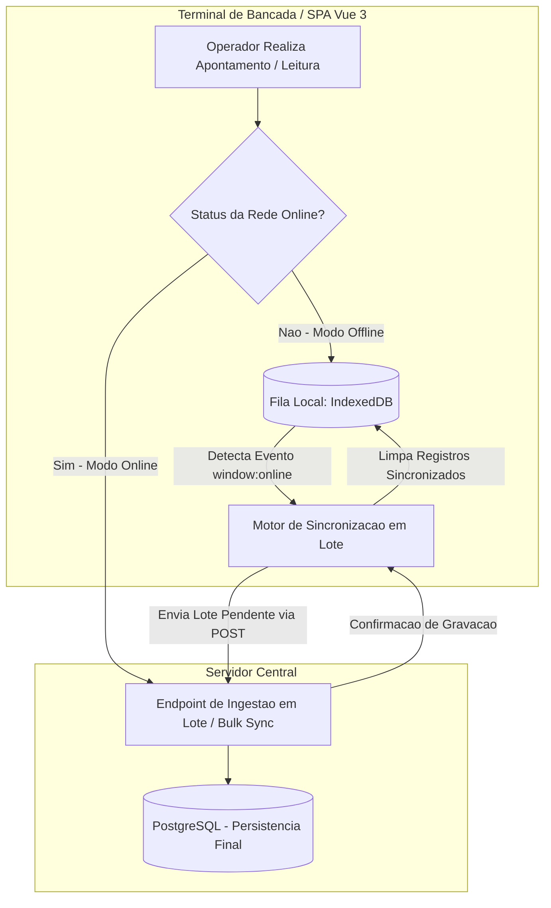

# Diretriz Corporativa: Arquitetura Offline-First para Terminais Industriais

## 1. Visão Geral e Necessidade Operacional
Em ambientes fabris, instabilidades temporárias de rede local (Wi-Fi de galpão, manutenções em switches ou oscilações de link) não podem paralisar o apontamento de operadores em esteiras e bancadas.

As interfaces industriais devem operar sob a arquitetura **Offline-First**, permitindo o registro ininterrupto de eventos mesmo sem conexão ativa com o backend.

---

## 2. Diagrama de Fluxo de Contingência e Sincronização

---

## 3. Regras de Implementação no Front-End

### 3.1. Armazenamento Local via IndexedDB
* **Mecanismo:** Utilização da API nativa `IndexedDB` (preferencialmente encapsulada por bibliotecas leves e tipadas como `idb` ou `Dexie.js`).
* **Estrutura do Registro:** Todo apontamento enfileirado localmente deve possuir:
  * `client_id`: UUIDv7 gerado no próprio front-end para garantir unicidade e idempotência.
  * `unit_id`: Código da fábrica do operador.
  * `payload`: Dados estruturados da operação.
  * `created_at`: Carimbo de hora exata em que o operador realizou a ação física.
  * `sync_status`: Estado da fila (`PENDING`, `SYNCING`, `FAILED`).

### 3.2. Sincronização Automática e Idempotência
* **Gatilhos de Reenvio:**
  1. Evento nativo do navegador `window.addEventListener('online', ...)`.
  2. Heartbeat em segundo plano a cada 30 segundos verificando a disponibilidade do endpoint de healthcheck.
* **Envio em Lote (Bulk Sync):** O motor de sincronização deve despachar os registros pendentes em blocos únicos (ex: até 100 registros por chamada) para a rota `/api/v1/apontamentos/sync-batch`.
* **Proteção contra Duplicidade:** O backend deve utilizar o `client_id` (UUIDv7) como chave de desduplicação, garantindo que retransmissões não dupliquem apontamentos operacionais no banco.
