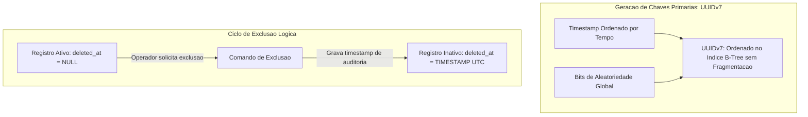

# Diretriz Corporativa: Modelagem de Dados, Chaves e Índices

## 1. Visão Geral e Princípio

Este documento estabelece as regras mandatórias para modelagem de entidades, chaves relacionais, colunas de auditoria e estratégias de indexação em todos os bancos de dados relacionais da organização. O objetivo é assegurar escalabilidade multi-unidades, integridade de dados e proteção contra degradação de desempenho em tabelas de alto volume.

---

## 2. Padrão de Chaves e Identificadores

### 2.1. Chave Primária Obrigatória (UUIDv7)

- **Padrão Oficial:** Todas as tabelas de negócio e operacionais devem utilizar obrigatoriamente UUIDv7 como chave primária.
- **Proibição de Identificadores Sequenciais:** É expressamente proibido o uso de números inteiros auto-incrementais ou sequenciais como chaves primárias. Essa restrição elimina riscos de colisão durante consolidação de bases entre unidades fabris e mitiga vulnerabilidades de enumeração em APIs.
- **Imutabilidade:** O identificador primário é imutável após sua gravação inicial.
- **Nomenclatura de Chaves:**
  - A chave primária da própria entidade deve ser nomeada estritamente como `id`.
  - Toda chave estrangeira (FK) deve adotar o nome da entidade relacionada no singular acrescido do sufixo `_id` (exemplo: `setor_id`, `usuario_id`, `ordem_producao_id`).

---

## 3. Metadados Mandatórios de Governança e Auditoria

Nenhuma tabela de domínio de negócio pode ser criada sem a estrutura de governança padrão. Toda entidade deve conter obrigatoriamente as seguintes colunas de sistema:

1. **`id`**: Identificador único global baseado no padrão UUIDv7.
2. **`unit_id`**: Código identificador da unidade fabril de origem e custódia do registro.
3. **`created_at`**: Registro temporal da criação do dado com fuso horário em tempo universal coordenado (UTC).
4. **`updated_at`**: Registro temporal da modificação mais recente com fuso horário em tempo universal coordenado (UTC).
5. **`deleted_at`**: Marcação temporal de exclusão lógica (campo nulo indica registro ativo).
6. **`created_by`**: Identificador do usuário, sistema ou processo que realizou o cadastro original.

---

## 4. Governança e Diretrizes de Índices

### 4.1. Indexação Mandatória de Chaves Estrangeiras (FKs)

- Todas as colunas que estabelecem relacionamentos estrangeiros devem possuir índice explícito. Esta regra é inegociável para evitar varreduras completas de tabelas (_table scans_) e bloqueios durante consultas relacionais ou operações em cascata.

### 4.2. Índices Compostos com Escopo Multi-Unidade

- Consultas operacionais em ambiente corporativo filtram rotineiramente pela unidade ativa.
- Em tabelas com grande volume de dados e múltiplos estados, os índices devem ser compostos, posicionando a coluna de maior restritividade no início da composição (exemplo: unidade fabril, seguido de status e data de emissão).

### 4.3. Unicidade com Suporte a Exclusão Lógica

- Restrições de unicidade de negócio (exemplo: códigos internos, crachás ou matrículas) devem ser implementadas exclusivamente através de índices parciais únicos, filtrando apenas registros onde o campo de exclusão lógica for nulo.

### 4.4. Política de Limite de Índices em Chão de Fábrica

- Tabelas destinadas a coletas de alta frequência (leituras de esteiras, sensores industriais, telemetria e registros de passagem de materiais) devem conter no máximo três índices estritamente indispensáveis. O excesso de índices é proibido nessas estruturas para não penalizar a velocidade de escrita do chão de fábrica.

---

## Fluxo de Integridade: UUIDv7 e Exclusão Lógica

