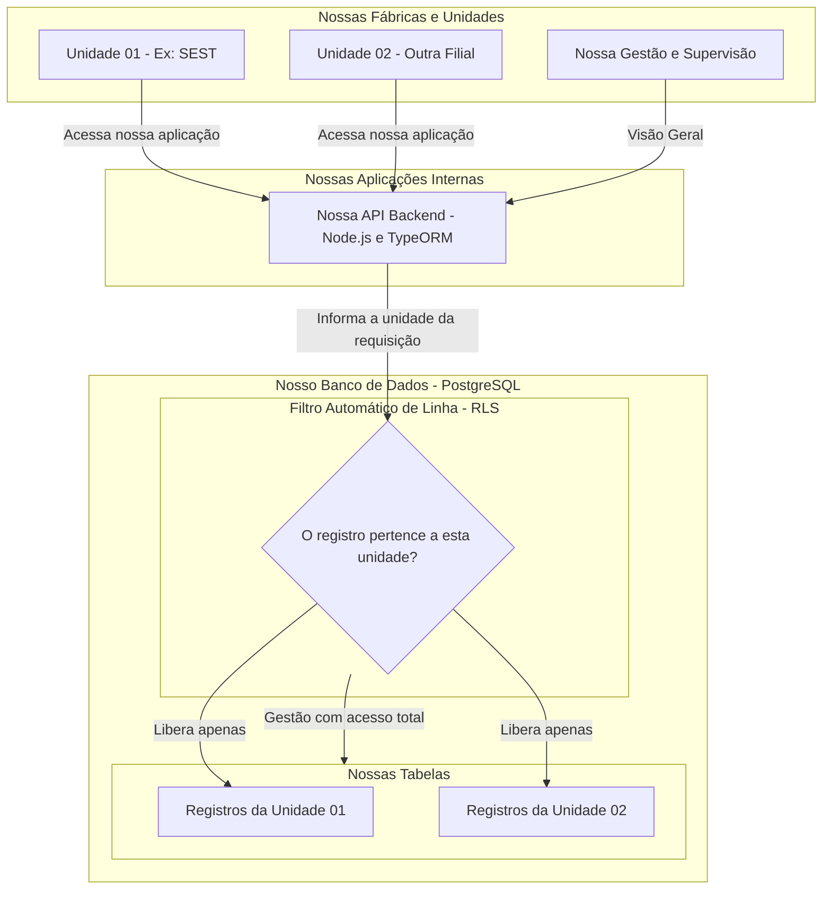
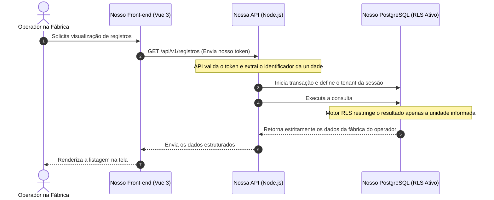

# Diretriz: Estratégia de Isolamento Multi-Tenancy e Políticas RLS

## 1. Visão Geral
Adotamos oficialmente o padrão de **Banco Único com Isolamento Lógico por Identificador de Unidade (Shared Database)**, reforçado por políticas de segurança a nível de linha (**Row-Level Security - RLS**).

* **Objetivo:** Centralizar manutenções e custos em uma única infraestrutura, simplificar migrações do TypeORM e viabilizar relatórios gerenciais consolidados em tempo real entre todas as unidades.

---

## 2. Diagrama de Isolamento das Unidades

---

## 3. Fluxograma de Execução de uma Consulta

---

## 4. Regras Obrigatórias para Nossas Aplicações

### 4.1. Presença Obrigatória de `unit_id`
* Toda tabela transacional ou de cadastro operacional deve conter a coluna `unit_id VARCHAR(20) NOT NULL`.
* É proibido persistir registros operacionais sem a identificação da unidade de origem.
* O valor de `unit_id` deve ser extraído sempre do token validado na nossa API, nunca confiando em dados livres enviados pelo front-end.

### 4.2. Segurança Nativa (RLS)
* As tabelas devem ter o RLS habilitado no banco (`ALTER TABLE nome_tabela ENABLE ROW LEVEL SECURITY`).
* O banco de dados bloqueia consultas que tentem ler ou alterar registros de outras unidades.

### 4.3. Indexação Composta
* Índices em tabelas transacionais devem incluir `unit_id` no início da composição (ex: `unit_id, created_at` ou `unit_id, status`) para otimizar os planos de execução com o filtro do RLS.