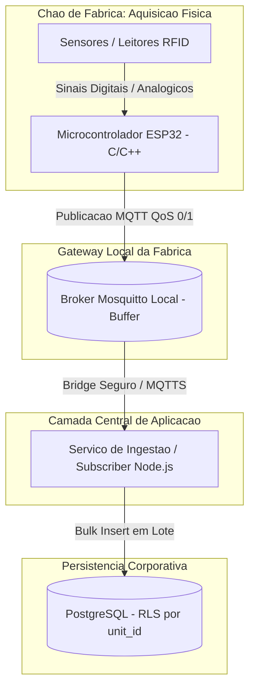

# Diretriz Corporativa: Barramento MQTT e Automação IoT Industrial

## 1. Visão Geral e Topologia de Chão de Fábrica
A integração entre o ecossistema físico industrial (sensores, esteiras, leitores RFID e balanças) e as aplicações centrais é realizada por meio de uma arquitetura orientada a eventos baseada no protocolo **MQTT (Message Queuing Telemetry Transport)**.

A topologia é estruturada em 3 níveis:
1. **Dispositivos de Borda (Edge):** Microcontroladores de bancada (ESP32 desenvolvidos em C/C++) conectados diretamente aos sensores físicos.
2. **Gateways Intermediários Locais:** Servidores locais na planta industrial executando brokers Mosquitto para bufferização, mitigação de instabilidades de rede e agregação local.
3. **Backend Central e Ingestão:** Microsserviços e subscribers Node.js que consomem as mensagens do barramento corporativo, validam esquemas e persistem dados no PostgreSQL.

---

## 2. Diagrama de Ingestão e Fluxo de Telemetria



---

## 3. Taxonomia Oficial de Tópicos MQTT
A hierarquia de tópicos deve refletir estritamente o isolamento multi-unidade e a árvore física do chão de fábrica:

* **Telemetria e Leituras Contínuas:**
  `fabrica/{unit_id}/setor/{sector_id}/maquina/{device_id}/telemetria`
* **Comandos e Atuações Remotas:**
  `fabrica/{unit_id}/setor/{sector_id}/maquina/{device_id}/comando`

### Exemplos de Tópicos Válidos:
* `fabrica/SEST/setor/CORTE/maquina/BALANCA_01/telemetria`
* `fabrica/SEST/setor/PREPARACAO/maquina/ESTEIRA_04/comando`

---

## 4. Contrato de Mensagem (JSON Payload)

Toda mensagem trafegada no barramento deve adotar a estrutura JSON com codificação UTF-8 e os seguintes campos mandatórios:

```json
{
  "device_id": "ESP32_CORTE_01",
  "unit_id": "SEST",
  "timestamp": "2026-09-17T13:45:00.000Z",
  "event_type": "READING_WEIGHT",
  "reading_value": 42.75,
  "quality_code": 192
}
```

### Definição dos Campos:
* `device_id` *(string)*: Identificador único de hardware do dispositivo de bancada.
* `unit_id` *(string)*: Identificador corporativo da unidade/filial (`VARCHAR(20)`).
* `timestamp` *(string)*: Carimbo de data/hora no padrão ISO-8601 em fuso UTC.
* `event_type` *(string)*: Tipo de evento operacional (ex: `READING_WEIGHT`, `RFID_READ`, `MACHINE_STOP`).
* `reading_value` *(number | string | boolean)*: Valor mensurado pelo sensor.
* `quality_code` *(number)*: Código de qualidade industrial da medição (ex: `192` = Good / OK, `0` = Bad / Sensor Fail).

---

## 5. Resiliência e Níveis de Qualidade de Serviço (QoS)

* **QoS 0 (At most once):** Permitido exclusivamente para telemetrias de alta frequência onde a perda pontual de uma leitura intermediária é tolerável (ex: temperatura ambiente de 5 em 5 segundos).
* **QoS 1 (At least once):** Mandatório para comandos de máquina, apontamentos de produção, leituras de RFID e paradas de linha.
* **Bufferização Local:** Em caso de perda de link WAN entre a fábrica e a nuvem/datacenter central, o broker Mosquitto local deve reter mensagens em disco em fila persistente até o restabelecimento da conexão.
