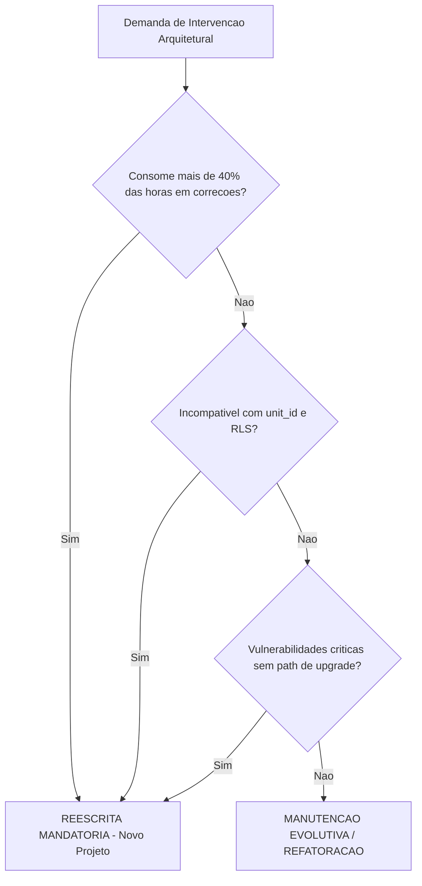

# Diretriz Corporativa: Ciclo de Vida de Software e Governança de Aplicações

## 1. Visão Geral
Esta diretriz estabelece os critérios objetivos para evolução, refatoração, descontinuação e versionamento de todas as aplicações e microsserviços do ecossistema corporativo.

---

## 2. Matriz de Decisão: Refatoração vs. Reescrita (Rewrite)

Toda demanda de intervenção arquitetural deve ser avaliada segundo critérios objetivos antes da aprovação de uma nova frente de trabalho:

### 2.1. Critérios para Manutenção e Refatoração
A aplicação permanece no ciclo de refatoração contínua quando:
* O débito técnico é pontual (ex: queries lentas, falta de índices, desacoplamento de serviços internos).
* Novas regras de negócio se encaixam no modelo de domínio e bounded context existente.
* O custo estimado de manutenção é inferior a 40% da capacidade produtiva do time responsável.

### 2.2. Critérios Rígidos para Descarte e Reescrita (Rewrite)
A reescrita de uma aplicação torna-se obrigatória quando constatado pelo menos um dos seguintes fatores:
1. **Custo Operacional Excessivo:** O esforço de correção de bugs e sustentação consome rotineiramente mais de 40% das horas do time.
2. **Incompatibilidade com Multi-Tenancy:** Impossibilidade técnica de suportar isolamento lógico por `unit_id` e RLS sem romper a integridade de dados do domínio.
3. **Obsolescência e Risco de Segurança:** Uso de stacks, bibliotecas ou frameworks descontinuados com vulnerabilidades ativas e sem viabilidade de atualização direta.

---

## 3. Versionamento e Depreciação de Contratos de API

Para garantir estabilidade das operações nas plantas industriais sem bloquear a inovação do backend:

* **Padrão de URI:** Versionamento explícito na rota base (`/api/v1/`, `/api/v2/`).
* **Janela de Suporte de Depreciação:** Toda versão de API depreciada deve manter retrocompatibilidade e suporte ativo por uma **janela estrita de 60 dias** a partir da publicação da versão sucessora.
* **Cabeçalhos de Aviso:** APIs depreciadas devem emitir os cabeçalhos padrão HTTP `Deprecation: true` e `Sunset: <data UTC>` em todas as respostas durante a janela de transição.
* **Desativação (Sunset):** Após o encerramento da janela de 60 dias, a versão anterior é permanentemente desativada no Gateway de Borda (retornando `HTTP 410 Gone`).

---

## 4. Estágios do Ciclo de Vida do Software

1. **Desenvolvimento / Homologação:** Desenvolvimento guiado por branch `develop`, testes automatizados e validação em ambiente de QA.
2. **Operação Ativa (Produção):** Deploy via branch `main`, telemetria ativa, monitoramento de SLAs e logs estruturados.
3. **Depreciação (Maintenance / Sunset):** Aplicação em regime de congelamento funcional; apenas correções de segurança críticas são aceitas durante o período de substituição.
4. **Desativação (Decommissioned):** Arquivamento de repositório, remoção de containers dos servidores e arquivamento de logs de auditoria.
