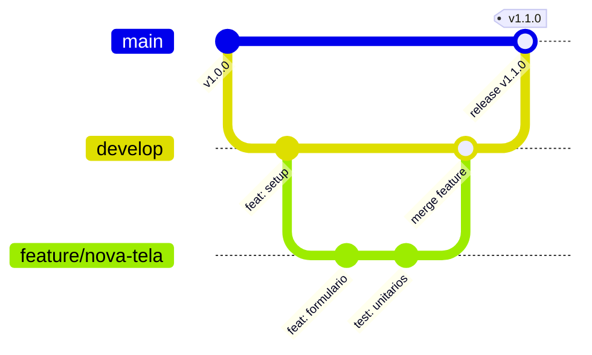

# Diretriz Corporativa: Estratégia de Branches (Git Flow) e Versionamento

## 1. Visão Geral
Esta diretriz padroniza o fluxo de trabalho colaborativo em controle de versão (Git) e estabelece a política oficial de versionamento semântico e publicação de releases para todas as aplicações da empresa.

---

## 2. Diagrama do Fluxo de Branches

---

## 3. Estrutura Canônica de Branches

* **`main` (Produção):** Contém estritamente o código que está rodando em produção. Cada deploy em `main` deve receber uma tag Git assinada seguindo o padrão SemVer (`vX.Y.Z`).
* **`develop` (Homologação / QA):** Branch integradora de desenvolvimento. Recebe os merges das features concluídas e alimenta o ambiente de testes/homologação.
* **`feature/<nome-descritivo>`:** Branches criadas a partir de `develop` para desenvolvimento de novas funcionalidades ou melhorias. Devem ser integradas exclusivamente via Pull Request revisado por pares.
* **`hotfix/<nome-descritivo>`:** Criadas diretamente a partir de `main` para correção emergencial de incidentes em produção. Devem ser mergeadas de volta tanto na `main` quanto na `develop`.

---

## 4. Política de Versionamento Semântico (SemVer)

As versões de release devem adotar o formato `vMAJOR.MINOR.PATCH`:
* **`MAJOR` (Quebra de Compatibilidade):** Alterações de arquitetura que quebram contratos existentes de API ou esquema de banco.
* **`MINOR` (Nova Funcionalidade):** Inclusão de novos endpoints, telas ou relatórios sem impacto regressivo.
* **`PATCH` (Correção de Bugs):** Correções pontuais de defeitos e vulnerabilidades sem adição de novas funcionalidades.

---

## 5. Padrão de Commits Semânticos (Conventional Commits)

As mensagens de commit devem seguir o padrão:
`tipo(escopo): descrição sucinta no imperativo`

* `feat`: Nova funcionalidade para o usuário.
* `fix`: Correção de bug.
* `docs`: Alterações exclusivamente em documentação.
* `refactor`: Refatoração de código sem alteração de comportamento externo.
* `perf`: Melhoria de performance de processamento ou query.
* `test`: Adição ou correção de testes automatizados.
